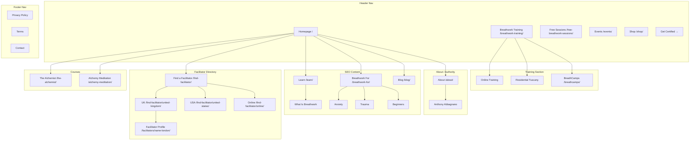

# Site Architecture Map: Alchemy of Breath

**Domain**: alchemyofbreath.com
**Date**: March 2026
**Skill**: marketing-skills/site-architecture v1.1.0
**Current state**: Reconstructed from Google index — full crawl pending WAF fix

---

## Current Architecture (Reconstructed from Index)

Known issues:
- Blog posts at root level (no `/blog/` namespace)
- `/BreathCamps/` uppercase URL
- `/breathwork-training-backup/` indexed backup page
- No clear URL hierarchy for informational content
- Two separate domains (alchemyofbreath.com + academyalchemyofbreath.com)

```
alchemyofbreath.com/
├── / (Homepage)
├── /breathwork-training/               ✅ Key conversion page
├── /breathwork-training-backup/        ❌ Should be noindexed/removed
├── /live-residential-breathwork-facilitator-training/  ⚠️ Cannibalization risk
├── /the-alchemist/                     ✅ Course page
├── /free-breathwork-sessions/          ✅ Lead gen page
├── /events/                            ✅ Events hub
├── /who-is-alchemy-of-breath/          ✅ About
├── /shop/                              ✅ E-commerce
├── /BreathCamps/                       ⚠️ Uppercase URL
├── /anthony-abbagnano/                 ✅ Founder page (good E-E-A-T)
├── /alchemy-meditation-2/              ⚠️ Slug issue
├── /find-facilitator/                  ✅ Directory (untapped potential)
├── /author/amy/                        ⚠️ May be thin content
├── /benefits-of-doing-a-breathwork-facilitator-training-online/  ⚠️ Root-level blog
└── /what-is-the-difference-between-breathwork-functional-breath-work-pranayama/  ⚠️ Root-level, long URL
```

---

## Recommended Architecture (Target State)

### Design Principles Applied
1. All important pages within 2-3 clicks of homepage
2. Blog/content under `/blog/` for topical clustering
3. Informational content under `/learn/` or `/breathwork-guide/`
4. Facilitator directory expanded to location/profile pages
5. Training pages clearly differentiated by format
6. Lowercase URLs throughout

```
alchemyofbreath.com/
│
├── / (Homepage)
│   ← Hub linking to all L1 sections
│
├── /breathwork-training/               [KEEP — primary training hub]
│   ├── /breathwork-training/online/    [or keep as /breathwork-training/ if online is primary]
│   └── /breathwork-training/residential/  [was: /live-residential-breathwork-facilitator-training/]
│
├── /breathcamps/                       [FIX: was /BreathCamps/]
│   ├── /breathcamps/tuscany/           [Specific retreat pages]
│   └── /breathcamps/online/
│
├── /the-alchemist/                     [KEEP — Inner Journey course]
│
├── /free-breathwork-sessions/          [KEEP — lead gen]
│
├── /events/                            [KEEP — events hub]
│
├── /shop/                              [KEEP — e-commerce]
│
├── /find-facilitator/                  [EXPAND — facilitator directory hub]
│   ├── /find-facilitator/online/
│   ├── /find-facilitator/united-kingdom/
│   │   ├── /find-facilitator/united-kingdom/london/
│   │   └── /find-facilitator/united-kingdom/edinburgh/
│   ├── /find-facilitator/united-states/
│   │   ├── /find-facilitator/united-states/new-york/
│   │   └── /find-facilitator/united-states/los-angeles/
│   └── /facilitators/[name]-[city]/    [Individual facilitator profiles]
│
├── /learn/                             [NEW — informational/SEO hub]
│   ├── /learn/what-is-breathwork/      [was: root-level long URL]
│   ├── /learn/breathwork-vs-pranayama/ [was: root-level long URL]
│   ├── /learn/breathwork-techniques/   [NEW]
│   └── /learn/breathwork-science/      [NEW]
│
├── /breathwork-for/                    [NEW — condition/audience hub]
│   ├── /breathwork-for/anxiety/
│   ├── /breathwork-for/trauma/
│   ├── /breathwork-for/stress/
│   ├── /breathwork-for/beginners/
│   ├── /breathwork-for/sleep/
│   ├── /breathwork-for/ptsd/
│   ├── /breathwork-for/therapists/
│   ├── /breathwork-for/yoga-teachers/
│   └── /breathwork-for/corporate/
│
├── /blog/                              [RESTRUCTURE — move root-level posts here]
│   ├── /blog/benefits-breathwork-facilitator-training-online/  [shortened URL]
│   ├── /blog/breathwork-benefits/      [NEW]
│   ├── /blog/breathwork-certification-guide/  [NEW]
│   └── /blog/category/
│       ├── /blog/category/breathwork-basics/
│       ├── /blog/category/facilitator-training/
│       └── /blog/category/breathwork-science/
│
├── /about/                             [CONSIDER renaming /who-is-alchemy-of-breath/]
│   └── /about/anthony-abbagnano/       [or keep at current URL]
│
└── /alchemy-meditation/                [FIX: rename from /alchemy-meditation-2/]
```

---

## Visual Sitemap (Mermaid)



---

## URL Map Table

| Page | Current URL | Recommended URL | Action | Priority |
|------|-------------|----------------|--------|----------|
| Homepage | / | / | Keep | — |
| Training Hub | /breathwork-training/ | /breathwork-training/ | Keep | — |
| Training Backup | /breathwork-training-backup/ | — | Noindex + 301 | P0 |
| Residential Training | /live-residential-breathwork-facilitator-training/ | /breathwork-training/residential/ | 301 + restructure | P2 |
| BreathCamps | /BreathCamps/ | /breathcamps/ | 301 (fix case) | P1 |
| The Alchemist | /the-alchemist/ | /the-alchemist/ | Keep | — |
| Free Sessions | /free-breathwork-sessions/ | /free-breathwork-sessions/ | Keep | — |
| Events | /events/ | /events/ | Keep | — |
| About | /who-is-alchemy-of-breath/ | /about/ OR keep | Optional 301 | P3 |
| Founder | /anthony-abbagnano/ | /about/anthony-abbagnano/ OR keep | Optional | P3 |
| Shop | /shop/ | /shop/ | Keep | — |
| Find Facilitator | /find-facilitator/ | /find-facilitator/ | Keep + expand | P2 |
| Meditation | /alchemy-meditation-2/ | /alchemy-meditation/ | 301 (fix slug) | P1 |
| Author page | /author/amy/ | /blog/author/amy/ | Evaluate (thin?) | P2 |
| Blog post 1 | /benefits-of-doing-a-breathwork-facilitator-training-online/ | /blog/benefits-breathwork-facilitator-training-online/ | 301 + move | P2 |
| Blog post 2 | /what-is-the-difference-between-breathwork-functional-breath-work-pranayama/ | /learn/breathwork-vs-pranayama/ | 301 + move | P2 |

---

## Navigation Specification

### Header Navigation (Recommended)

```
[Logo]  |  Training  |  BreathCamps  |  Events  |  Blog  |  Find a Facilitator  |  [Free Session →]
```

- **Training** → dropdown: Online Training | Residential | Free Sessions
- **BreathCamps** → direct link to /breathcamps/
- **Events** → /events/
- **Blog** → /blog/
- **Find a Facilitator** → /find-facilitator/
- **CTA**: "Free Session" → /free-breathwork-sessions/

Current issue: "The Alchemist" and "Alchemy Meditation" likely buried. Either add to training dropdown or feature on homepage.

### Footer Navigation (Recommended)

```
TRAIN              EXPLORE            COMPANY           LEGAL
Facilitator        What is Breathwork About AoB         Privacy Policy
Training           Breathwork for     Anthony           Terms
BreathCamps        Anxiety            Abbagnano         Accreditations
Free Sessions      Trauma             Contact
Find Facilitator   Blog
Shop
```

---

## Internal Linking Plan

### Hub Pages and Their Spokes

**Training Hub** (`/breathwork-training/`):
- Links TO: Online variant, Residential variant, BreathCamps, Free Sessions (CTA), Facilitator directory (graduates)
- Receives links FROM: Homepage (primary CTA), Blog posts about training, Breathwork-for pages (CTA)

**Breathwork-For Hub** (`/breathwork-for/`):
- Links TO: All condition pages
- Receives links FROM: Homepage, Free Sessions page, Blog posts
- Each condition page links TO: Free Sessions (CTA), Training page (upsell), Facilitator directory

**Facilitator Hub** (`/find-facilitator/`):
- Links TO: Country/city pages → Individual profiles
- Receives links FROM: Homepage, Training page (graduates), About page
- Each profile links TO: Training (become a facilitator), Free Sessions

**Blog Hub** (`/blog/`):
- Links TO: All blog posts
- Each post links TO: Relevant training page, relevant breathwork-for page, free sessions
- Uses topic clusters — posts in same category cross-link

### Orphan Page Audit

After WAF fix, run Screaming Frog → Internal → filter by "Inlinks = 0" to find orphan pages.

Known candidates for orphan risk:
- `/alchemy-meditation-2/` — likely few inlinks given bad slug
- Root-level blog posts — may not appear in any navigation or category listing
- Individual author page `/author/amy/`

---

## Redirect Map (All P1/P2 Changes)

```
# Priority fixes
301 /breathwork-training-backup/ → /breathwork-training/
301 /BreathCamps/ → /breathcamps/
301 /alchemy-meditation-2/ → /alchemy-meditation/

# Blog restructure (after creating /blog/ section)
301 /benefits-of-doing-a-breathwork-facilitator-training-online/ → /blog/benefits-breathwork-facilitator-training-online/
301 /what-is-the-difference-between-breathwork-functional-breath-work-pranayama/ → /learn/breathwork-vs-pranayama/

# Training restructure (optional Phase 2)
301 /live-residential-breathwork-facilitator-training/ → /breathwork-training/residential/

# Implement in WordPress via .htaccess or Redirection plugin
```

---

*Built using: marketing-skills/site-architecture v1.1.0 | Claude Code | March 2026*
*Data: Reconstructed from Google index — full crawl required after WAF fix for complete URL inventory*
